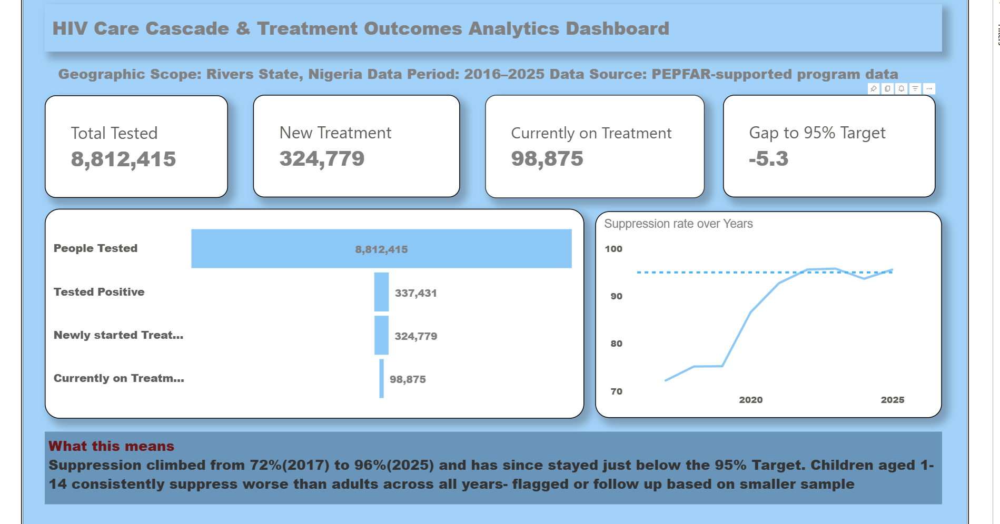

# Rivers State HIV Care Cascade Analysis

An end-to-end data analytics project tracking HIV testing, treatment, and viral suppression outcomes in Rivers State, Nigeria — built on real PEPFAR public health data (2016-2025).

**[View the interactive dashboard →](https://app.powerbi.com/view?r=eyJrIjoiN2VkNGZjOGUtN2Q5Ni00ZTNkLTlhZTgtMzdhZGY4NDI5YjUzIiwidCI6ImVmNDcyYTAzLWQ0ZmQtNDBiMi1hOTBjLTUxMGU3NDg1ZDlmNCJ9" frameborder="0" allowFullScreen="true"></iframe>)

---

## The Story

While validating this dataset, I found my "Total Tested" figure came out to **12 million people — in a state with a population of roughly 7 million.** That discrepancy led to uncovering a real data structure issue in PEPFAR's reporting: the same population is reported at multiple overlapping age-band granularities, and summing them together silently double- and triple-counts real people.

This repo documents the full pipeline that found, diagnosed, and corrected that issue — along with several other data quality problems (Excel-corrupted values, precision loss, and structural inconsistencies) — before producing final analysis.

## Key Findings

- **Viral suppression rate rose from 72% (2017) to 96% (2023)**, a sustained multi-year improvement, now plateaued just below the UNAIDS 95% target
- **The steepest cascade drop-off occurs between testing positive and starting treatment** — a linkage gap worth targeted intervention
- **Children (ages 1-14) consistently show lower suppression rates than adults** across the full study period — flagged with an explicit small-sample caveat, not overstated as fact

## Pipeline

| Stage | Tool | What happened |
|---|---|---|
| 1. Data validation | Excel | Caught floating-point ID corruption, scientific-notation precision loss, embedded line breaks |
| 2. Reshaping & cleaning | Python (pandas) | Wide→long reshape, Excel date-corruption recovery for age bands, numerator/denominator suppression rate calculation |
| 3. Modeling & visualization | Power BI | Star schema (fact table + 3 dimension tables), DAX measures, 4-page interactive dashboard |

## Data Cleaning & Pipeline Architecture
The raw PEPFAR MER dataset required extensive programmatic reshaping and data hygiene checks before it could power the analytical model. The full pipeline is written in Python (cleaning_pipeline.py) and automates the following steps:

Pipeline Breakdown
- Wide-to-Long Reshaping: Separated static metadata and identity columns (id_columns) from historical reporting periods, melting the wide historical time columns into a clean, normalized structure.

- Period De-duplication & Extraction: Dropped null reporting periods and parsed the composite period string into distinct categorical attributes (Year, Quarter, and reporting Type [Result vs. Target]).

- Pivoting Viral Suppression Metrics (TX_PVLS): Isolated the viral load suppression indicator, pivoting the separately reported Numerator (N) and Denominator (D) rows onto a single row per demographic segment to enable accurate rate calculations.

- Recovery of Excel-Corrupted Age Bands: Handled silent data corruption caused by spreadsheet software converting text-based age ranges (like 10-14) into calendar dates, applying a custom extraction function to recover valid string identifiers.

- Suppression Rate Derivation: Calculated the official multi-year viral suppression percentage ([N / D] * 100) rounded to two decimal places.

- Schema Unification & Export: Recombined core clinical cascade metrics with the newly derived suppression rates, trimmed unnecessary identifiers, and exported an analysis-ready flat file (data/cleaned/rivers_hiv_cascade_final.csv).

 Detailed Log: For a granular breakdown of every data quality anomaly encountered—including floating-point ID corruption and multi-level age-band double-counting—see DATA_QUALITY_LOG.md.

Full write-up of every data quality issue found and how it was fixed: [`DATA_QUALITY_LOG.md`](DATA_QUALITY_LOG.md)

## Data Access

This project uses PEPFAR's public **Monitoring, Evaluation, and Reporting (MER) Clinical Cascade dataset**, filtered to Rivers State, Nigeria.

- Source: [data.pepfar.gov/datasets](https://data.pepfar.gov/datasets)
- Dataset used: "Clinical Cascade Results by Fine Age and Sex"
- License: Public domain, U.S. Government data

Raw data is not included in this repo due to file size — download instructions are in `data/raw/README.md`.

## Tech Stack

`Python (pandas)` · `Microsoft Excel` · `Power BI` · `DAX` · `Power Query`

## Known Limitations

- 2016-2017 have thin reporting density (fewer than 20 data points per quarter)
- 2025 includes Q4 results only, per PEPFAR's own data release guidance
- TX_RET (standard retention indicator) is not present in current MER guidance; TX_CURR and TX_NET_NEW are used as proxies
- Full limitations documented in [`docs/METHODOLOGY.md`](docs/METHODOLOGY.md)

## About Me

Built by **Godswill Ndukachukwu Douglas** — Data Analyst, Microsoft PL-300 certified.
[LinkedIn](#) · [Portfolio](#)
